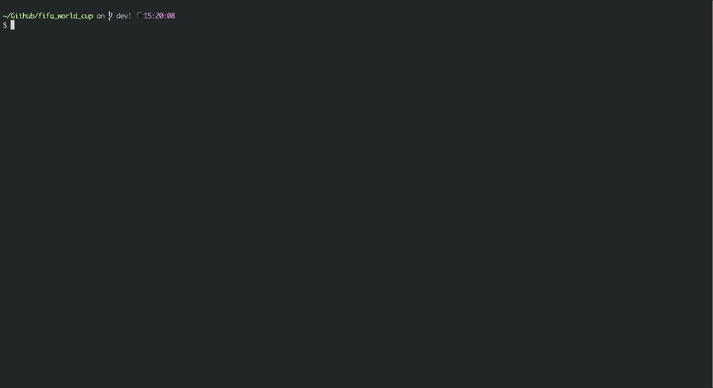

# 2018世界杯命令行

周末无聊做的命令行工具，目前功能简单，有时间的话会增加


## Quick start

```shell
1. pip3 install -r requirements.txt
2. python3 fifa.py -l
```


## 使用方法

```python3 fifa.py -h ``` 查看使用帮助

### 查看比赛场次

```python3 fifa.py -l``` 查看比赛的场次


## Screenshot

